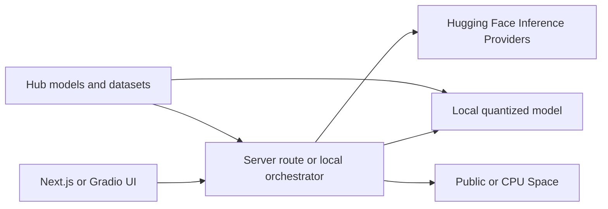

# Hugging Face — Free Resources Guide

**Last reviewed:** July 2026

Hugging Face is best used in a free stack as a discovery, prototyping, and local-model layer. Models, datasets, libraries, and many community demos are free; persistent GPU compute and production-scale inference generally are not.

> Quotas and pricing change. Verify the official documentation before depending on a limit in production.

## What is free

| Resource | Free offering | Main limitation |
|---|---|---|
| **Models** | Download and run open models locally | Hardware requirements and each model's license |
| **Datasets** | Download, preview, stream, and load data with `datasets` | Some datasets are gated or require approval |
| **Public Spaces** | Use community AI apps in the browser | Queues, rate limits, sleep, and app availability |
| **CPU Space hosting** | 2 vCPU, 16 GB RAM, 50 GB ephemeral disk | Sleeps when inactive; disk is not persistent |
| **ZeroGPU Spaces** | Use shared GPU-backed Spaces | Free accounts receive about 5 GPU minutes per day |
| **Inference Providers** | Small monthly API credit | Free-user credit is about $0.10/month and may change |
| **Hub repositories** | Host models, datasets, and Spaces | Private storage is limited; public storage must be useful and responsible |
| **Open-source libraries** | Transformers, Diffusers, Datasets, Gradio, TRL, PEFT, Accelerate, and more | Compute and external infrastructure are separate |

## Useful public Spaces

| Space | Use case |
|---|---|
| [Gemma 4 12B IT](https://huggingface.co/spaces/huggingface-projects/gemma-4-12b-it) | Multimodal chat with text, images, audio, and video |
| [Qwen3-TTS](https://huggingface.co/spaces/Qwen/Qwen3-TTS) | Text-to-speech, presets, and voice cloning |
| [OmniVoice](https://huggingface.co/spaces/k2-fsa/OmniVoice) | Multilingual speech synthesis and voice cloning |
| [Kokoro TTS](https://huggingface.co/spaces/hexgrad/Kokoro-TTS) | Lightweight text-to-speech |
| [Krea 2](https://huggingface.co/spaces/krea/Krea-2) | Text-to-image generation |
| [Qwen3 VL Demo](https://huggingface.co/spaces/Qwen/Qwen3-VL-Demo) | Vision-language chat and image understanding |
| [LTX 2.3 Image-to-Video](https://huggingface.co/spaces/jasfn/LTX-2.3-10Eros) | Image-to-video generation with audio |

Community Spaces can change, pause, or disappear. Treat them as experimentation tools rather than production dependencies.

## Models worth exploring locally

| Model | Why it is useful | License shown on Hub |
|---|---|---|
| [Baidu Unlimited OCR](https://huggingface.co/baidu/Unlimited-OCR) | Multilingual OCR and document understanding | MIT |
| [InternScience Agents-A1](https://huggingface.co/InternScience/Agents-A1) | Agentic multimodal workflows | Apache-2.0 |
| [GLM-5.2](https://huggingface.co/zai-org/GLM-5.2) | General-purpose language model | MIT |
| [Qwythos 9B GGUF](https://huggingface.co/empero-ai/Qwythos-9B-Claude-Mythos-5-1M-GGUF) | Quantized local inference with llama.cpp or LM Studio | Apache-2.0 |
| [ThinkingCap Qwen 27B](https://huggingface.co/bottlecapai/ThinkingCap-Qwen3.6-27B) | Reasoning and multimodal experimentation | Apache-2.0 |

Always verify the current model card, upstream base-model terms, and license before commercial use.

## Datasets for agent builders

| Dataset | Use case |
|---|---|
| [Fable 5 Agent Traces](https://huggingface.co/datasets/Glint-Research/Fable-5-traces) | Coding-agent traces and tool-use analysis |
| [EdgeBench](https://huggingface.co/datasets/ByteDance-Seed/EdgeBench) | Evaluation of long-horizon autonomous agents |
| [IFStruct](https://huggingface.co/datasets/LiquidAI/ifstruct-v1.0) | JSON/YAML and structured-output compliance |
| [Antidoom Mix](https://huggingface.co/datasets/LiquidAI/antidoom-mix-v1.0) | Prompt and training research |
| [Complete FABLE.5 Traces](https://huggingface.co/datasets/Crownelius/Complete-FABLE.5-traces-2M) | Larger corpus of coding-agent traces |

## Recommended free-stack architecture



1. Use **Gradio** or the existing Next.js frontend for the first UI.
2. Run small or quantized models locally with **llama.cpp**, **Ollama**, or **LM Studio**.
3. Use public Spaces for manual experiments and capability discovery.
4. Use the free Inference Providers credit only for lightweight API validation.
5. Store public models, datasets, and demo code on the Hub.
6. Move to paid or self-hosted compute only after usage patterns are measurable.

## Optional API setup

Create a fine-grained Hugging Face token with permission to call Inference Providers, then keep it server-side:

```bash
# .env.local — never expose this as NEXT_PUBLIC_*
HF_TOKEN=hf_your_fine_grained_token
```

Minimal server-side example using the OpenAI-compatible endpoint:

```ts
import OpenAI from 'openai'

const client = new OpenAI({
  apiKey: process.env.HF_TOKEN,
  baseURL: 'https://router.huggingface.co/v1',
})

const response = await client.chat.completions.create({
  model: 'openai/gpt-oss-20b',
  messages: [{ role: 'user', content: 'Explain this architecture.' }],
})

console.log(response.choices[0]?.message.content)
```

Model availability and provider routing can change. Select a currently supported Inference Providers model before using this example.

## Production cautions

- Do not depend on community Spaces for availability-critical workflows.
- Never expose a Hugging Face access token in frontend code.
- Use fine-grained tokens and separate development and production credentials.
- Add request limits, caching, observability, and fallback providers.
- Check model and dataset licenses before commercial use or redistribution.
- Budget for compute once an AI feature has real traffic; the free API credit is for experiments.

## Official references

- [Hugging Face Hub](https://huggingface.co/)
- [Spaces overview](https://huggingface.co/docs/hub/spaces-overview)
- [ZeroGPU documentation](https://huggingface.co/docs/hub/spaces-zerogpu)
- [Inference Providers pricing](https://huggingface.co/docs/inference-providers/pricing)
- [Storage limits](https://huggingface.co/docs/hub/storage-limits)
